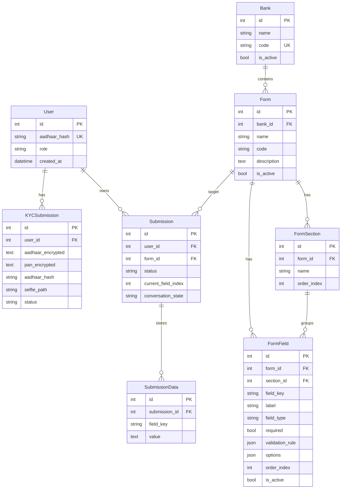

# 🏦 BankAI — Complete Project Summary

> **AI-Powered KYC Verification & Dynamic Banking Forms Platform**
> Author: Pavan Hegade · Version: 2.0.0 · License: Proprietary

---

## 1. What Is BankAI?

BankAI is a **production-grade, full-stack banking platform** that combines:

| Capability | Description |
|---|---|
| 🔐 **Camera-Based KYC** | Aadhaar & PAN card scanning via Tesseract.js OCR + live selfie capture |
| 🤖 **AI Voice Agent** | Conversational assistant that walks users through forms via voice or text |
| 🏛️ **Admin Panel** | Full CRUD for banks, forms, fields, sections & submission management |
| 🛡️ **Field-Level Encryption** | Aadhaar/PAN encrypted at rest (Fernet AES-128) + SHA-256 hashing |
| 🗃️ **Dynamic Form Engine** | DB-driven forms — no hardcoded fields in business logic |
| 📊 **Submission Tracking** | State-machine-driven lifecycle with resume support |

---

## 2. Tech Stack

### Frontend
| Technology | Purpose |
|---|---|
| HTML5 + CSS3 | Semantic markup, glassmorphism dark theme |
| Vanilla JavaScript (ES6+) | No framework overhead |
| Tesseract.js v5 | Client-side OCR for document scanning |
| Web Speech API | Text-to-speech for AI agent responses |
| MediaStream API | Camera access for document/selfie capture |
| Inter (Google Fonts) | Modern typography |

### Backend
| Technology | Purpose |
|---|---|
| FastAPI | Async Python API framework |
| PostgreSQL 12+ | Production RDBMS |
| SQLAlchemy 2.0 | ORM with connection pooling |
| Alembic | Version-controlled DB migrations |
| Pydantic v2 | Request/response validation |
| Fernet (cryptography) | AES-128 encryption for PII |
| python-jose | JWT creation & verification (HS256) |
| SlowAPI | IP-based rate limiting |
| uvicorn | ASGI server with auto-reload |

---

## 3. Architecture & File Structure

```
bankAI/
├── index.html              ← KYC verification wizard (3-step)
├── dashboard.html          ← User dashboard + AI voice chat agent
├── admin.html              ← Admin panel (banks, forms, submissions)
├── css/
│   └── styles.css          ← Design system (glassmorphism, dark, animations)
├── js/
│   ├── app.js              ← KYC flow orchestration
│   ├── camera.js           ← Camera access & document capture
│   ├── ocr.js              ← Tesseract.js OCR (Aadhaar/PAN extraction)
│   ├── selfie.js           ← Live selfie with face circle overlay
│   └── admin.js            ← Admin CRUD, auth, submission viewer
├── backend/
│   ├── app/
│   │   ├── main.py         ← FastAPI app entry point + middleware
│   │   ├── database.py     ← SQLAlchemy engine & session factory
│   │   ├── models.py       ← All ORM models (8 tables)
│   │   ├── schemas.py      ← All Pydantic schemas (~25 schemas)
│   │   ├── core/
│   │   │   ├── config.py       ← pydantic-settings (env vars)
│   │   │   ├── encryption.py   ← Fernet encrypt/decrypt + SHA-256
│   │   │   ├── security.py     ← JWT create/verify + auth dependencies
│   │   │   ├── logging.py      ← Structured logging with PII redaction
│   │   │   ├── rate_limit.py   ← SlowAPI rate limiter setup
│   │   │   └── seed.py         ← Idempotent seed (SBI, 3 forms, admin)
│   │   ├── api/v1/
│   │   │   ├── kyc.py          ← POST submit, GET status
│   │   │   ├── auth.py         ← GET /me
│   │   │   ├── forms.py        ← Public form listing & detail
│   │   │   ├── submissions.py  ← Create, answer, complete
│   │   │   ├── conversation.py ← AI agent start & turn endpoints
│   │   │   └── admin.py        ← Admin-only CRUD endpoints
│   │   └── services/
│   │       ├── kyc_service.py          ← KYC business logic
│   │       ├── auth_service.py         ← Authentication logic
│   │       ├── form_service.py         ← Form retrieval logic
│   │       ├── submission_service.py   ← Submission lifecycle
│   │       ├── conversation_service.py ← AI state machine (654 lines)
│   │       └── admin_service.py        ← Admin operations
│   ├── alembic/             ← Migration scripts
│   ├── tests/               ← 9 test files (pytest)
│   ├── requirements.txt     ← Python dependencies
│   └── .env.example         ← Environment template
└── .gitignore
```

---

## 4. Frontend Pages (3 pages)

### 4.1 KYC Verification — `index.html`

A premium **3-step wizard** with glassmorphism dark theme:

| Step | Action | Technology |
|------|--------|------------|
| **Step 1** — Aadhaar | Camera auto-captures card → OCR extracts 12-digit number | Tesseract.js |
| **Step 2** — PAN | Camera auto-captures card → OCR extracts PAN | Tesseract.js |
| **Step 3** — Selfie | Face circle overlay → user captures live selfie | MediaStream API |
| **Submit** | Sends encrypted data to backend → receives JWT token | Fetch API |

**UI Features**: Scan-corner overlays, animated scan lines, countdown timers, OCR progress bars, particle success animation.

### 4.2 User Dashboard — `dashboard.html`

An AI-powered dashboard (~1768 lines, self-contained CSS):

- **Welcome Hero** — personalized greeting with selfie avatar & KYC verified badge
- **KYC Strip** — masked Aadhaar & PAN display
- **AI Chat Panel** — conversational interface with:
  - Robot avatar with eye-blink animation & speaking mouth animation
  - Chat bubbles (agent + user), typing indicators
  - Form selection chips for starting applications
  - Progress bar during form filling
  - Text-to-speech via Web Speech API
  - Microphone button with ripple animation for voice input

### 4.3 Admin Panel — `admin.html`

Full administration interface with sidebar navigation:

- **JWT Token Auth** — login screen, token validation
- **Banks Tab** — table view, create bank modal
- **Forms Tab** — table view with bank filter, form detail view with sections & fields, CRUD modals
- **Submissions Tab** — paginated list, detail view with field-level data
- **Toast notifications** — slide-in feedback for all operations

---

## 5. Database Models (8 tables)



### Key Enums
| Enum | Values |
|------|--------|
| `KYCStatus` | `pending`, `verified`, `rejected` |
| `FieldType` | `text`, `number`, `date`, `select`, `radio`, `checkbox` |
| `SubmissionStatus` | `draft`, `completed` |
| `ConversationState` | `chat`, `welcome`, `select_application`, `filling_form`, `review`, `complete` |

---

## 6. API Surface (27 endpoints)

### KYC
| Method | Endpoint | Auth |
|--------|----------|------|
| `POST` | `/api/v1/kyc/submit` | — |
| `GET` | `/api/v1/kyc/status/{id}` | Bearer |

### Auth
| Method | Endpoint | Auth |
|--------|----------|------|
| `GET` | `/api/v1/auth/me` | Bearer |

### Forms (Public)
| Method | Endpoint | Auth |
|--------|----------|------|
| `GET` | `/api/v1/forms/banks` | Bearer |
| `GET` | `/api/v1/forms/banks/{id}/forms` | Bearer |
| `GET` | `/api/v1/forms/{id}` | Bearer |

### Submissions
| Method | Endpoint | Auth |
|--------|----------|------|
| `POST` | `/api/v1/submissions/` | Bearer |
| `POST` | `/api/v1/submissions/{id}/answer` | Bearer |
| `POST` | `/api/v1/submissions/{id}/complete` | Bearer |
| `GET` | `/api/v1/submissions/{id}` | Bearer |

### Conversation (AI Agent)
| Method | Endpoint | Auth |
|--------|----------|------|
| `GET` | `/api/v1/conversation/start` | Bearer |
| `POST` | `/api/v1/conversation/turn` | Bearer |

### Admin (11 endpoints)
| Method | Endpoint | Auth |
|--------|----------|------|
| `POST` | `/api/v1/admin/banks` | Admin |
| `GET` | `/api/v1/admin/banks` | Admin |
| `POST` | `/api/v1/admin/forms` | Admin |
| `GET` | `/api/v1/admin/forms` | Admin |
| `PUT` | `/api/v1/admin/forms/{id}` | Admin |
| `POST` | `/api/v1/admin/forms/{id}/sections` | Admin |
| `POST` | `/api/v1/admin/forms/{id}/fields` | Admin |
| `PUT` | `/api/v1/admin/fields/{id}` | Admin |
| `DELETE` | `/api/v1/admin/fields/{id}` | Admin |
| `GET` | `/api/v1/admin/submissions` | Admin |
| `GET` | `/api/v1/admin/submissions/{id}` | Admin |

### Health
| Method | Endpoint |
|--------|----------|
| `GET` | `/api/health` |

---

## 7. Security Architecture

### Encryption & Hashing
- **Aadhaar & PAN** → Fernet (AES-128 CBC) encrypted at rest
- **Aadhaar deduplication** → SHA-256 hash (never decrypted for lookups)
- **Selfie** → saved to disk (path stored in DB, not base64 in DB)

### Authentication & Authorization
- **JWT tokens** → HS256, 24-hour expiry (configurable via `JWT_ACCESS_TOKEN_EXPIRE_MINUTES`)
- **Role-based access** → `user` role (default) vs `admin` role
- **Dev admin shortcut** → KYC with Aadhaar `999999999999` → admin JWT
- **3 auth dependencies**: `get_current_user_id`, `get_current_user`, `require_admin_user`

### Logging & PII Protection
- Automatic PII redaction in all log output (Aadhaar/PAN patterns)
- **X-Correlation-ID** request tracing
- Rotating file logs (10 MB max, 5 backups)

### Rate Limiting
- IP-based rate limiting via SlowAPI

---

## 8. Conversation State Machine (AI Agent)

```
CHAT → WELCOME → SELECT_APPLICATION → FILLING_FORM → REVIEW → COMPLETE
```

### Design Principles
- **Backend is single source of truth** — AI cannot skip states
- **Keyword-based intent detection** — no external LLM calls
- **Canned replies only** — all responses drawn from pre-defined templates
- **All validation enforced by backend** — AI cannot bypass rules

### Intent Categories
| Intent | Trigger Examples |
|--------|-----------------|
| Small talk | "hello", "hi", "how are you", "who are you" |
| Help | "help", "what can you do", "services", "menu" |
| Form selection | "open account", "aadhaar seeding", "cheque book" |
| Out of scope | anything else → polite redirect |

### Supported Form Intents
| Form Code | Keywords |
|-----------|----------|
| `account_opening` | "account", "savings", "new account", "open a" |
| `aadhaar_seeding` | "aadhaar", "aadhar", "link aadhaar", "seed" |
| `cheque_book_request` | "cheque", "checkbook", "chequebook" |

---

## 9. Dynamic Form Engine

All form structure is **entirely database-driven**:

- `is_active` flags → admin soft-delete/deactivation
- `order_index` on sections & fields → admin reordering
- `validation_rule` JSON → extensible validation (`pattern`, `min`, `max`, `min_length`, `max_length`)
- `options` JSON → dynamic select/radio/checkbox choices (`[{value, label}]`)

### Seed Data (loaded on startup, idempotent)
| Entity | Details |
|--------|---------|
| **1 Bank** | State Bank of India (SBI) |
| **3 Forms** | Account Opening (13 fields, 3 sections), Aadhaar Seeding (5 fields, 2 sections), Cheque Book Request (4 fields, 2 sections) |
| **1 Admin User** | Dev admin with known Aadhaar hash |

---

## 10. Testing Infrastructure

**9 test files** covering:

| Test File | Coverage Area |
|-----------|---------------|
| `test_auth.py` | JWT authentication flows |
| `test_encryption.py` | Fernet encrypt/decrypt + SHA-256 hashing |
| `test_api_kyc.py` | KYC submission API endpoints |
| `test_kyc_service.py` | KYC service business logic |
| `test_forms.py` | Form retrieval and listing |
| `test_submissions.py` | Submission lifecycle (create → answer → complete) |
| `test_conversation.py` | Conversation state machine + all states |
| `test_chat_endpoint.py` | Pre-submission chat mode (intents) |
| `conftest.py` | Test fixtures (DB session, test client, auth) |

**Run commands**:
```bash
pytest                          # All tests
pytest --cov=app --cov-report=html  # With coverage
pytest -m unit                  # Unit tests only
pytest -m integration           # Integration tests only
```

---

## 11. Configuration & Environment

| Variable | Required | Default | Description |
|----------|----------|---------|-------------|
| `DATABASE_URL` | ✅ | — | PostgreSQL connection string |
| `JWT_SECRET_KEY` | ✅ | — | Random hex string for JWT signing |
| `ENCRYPTION_KEY` | ✅ | — | Fernet key for PII encryption |
| `JWT_ALGORITHM` | — | `HS256` | JWT signing algorithm |
| `JWT_ACCESS_TOKEN_EXPIRE_MINUTES` | — | `1440` | Token expiry (24h) |
| `LOG_LEVEL` | — | `INFO` | Logging level |
| `LOG_FILE` | — | `logs/app.log` | Log file path |
| `CORS_ORIGINS` | — | `http://localhost:8000` | Comma-separated allowed origins |
| `APP_NAME` | — | `BankAI KYC API` | Application name |
| `APP_VERSION` | — | `2.0.0` | Application version |

---

## 12. How to Run

```bash
# 1. Clone
git clone https://github.com/07pavan/bankAI.git && cd bankAI

# 2. Create PostgreSQL DB
psql -U postgres -c "CREATE DATABASE bankai_db;"

# 3. Backend setup
cd backend
python -m venv bankAI && .\bankAI\Scripts\activate   # Windows
pip install -r requirements.txt
cp .env.example .env                                   # Edit with your keys

# 4. Run migrations
alembic upgrade head

# 5. Start server (seeds DB on startup)
python -m app.main
# → Server at http://localhost:8000

# 6. Access pages
#    KYC:       http://localhost:8000/index.html
#    Dashboard: http://localhost:8000/dashboard.html
#    Admin:     http://localhost:8000/admin.html
#    Swagger:   http://localhost:8000/docs
```

---

## 13. Key Design Decisions

| Decision | Rationale |
|----------|-----------|
| **Vanilla JS frontend** | Zero build step, no framework overhead, single-file pages |
| **FastAPI serves static files** | `app.mount("/", StaticFiles(...))` — single server for API + frontend |
| **No external LLM** | Conversation agent uses keyword matching → deterministic, fast, free |
| **Field-level encryption** | PII (Aadhaar/PAN) encrypted at rest, not just in transit |
| **State machine in DB** | `conversation_state` column → resumable sessions, backend-authoritative |
| **Idempotent seeding** | Safe to restart server anytime without duplicating seed data |
| **Self-contained pages** | `dashboard.html` and `admin.html` have all CSS inline (~800+ lines each) |

---

## 14. Current Project Status

> [!IMPORTANT]
> The project is in a **complete and functional** state as of the latest development cycle.

### ✅ Completed
- Full KYC verification flow (Aadhaar → PAN → Selfie → Submit)
- Dynamic form engine with 3 seeded SBI forms
- AI conversation agent (state machine, all states working)
- Admin panel (CRUD for banks, forms, sections, fields, submission viewer)
- JWT authentication with role-based access
- Field-level encryption (Fernet) + SHA-256 deduplication
- PII redaction in logs + correlation IDs
- Rate limiting (SlowAPI)
- Comprehensive test suite (9 test files)
- Professional README with full documentation
- Database migrations (Alembic)

### 🔜 Potential Next Steps
- **Deployment** — containerize with Docker, deploy to cloud (AWS/GCP/Azure)
- **Real LLM integration** — replace keyword matching with an actual NLP model for smarter form filling
- **File upload** — support document uploads (e.g., passport photo, address proof)
- **Email/SMS notifications** — notify users on KYC approval or submission status changes
- **Multi-language support** — Hindi and regional language interfaces
- **Face matching** — compare selfie with Aadhaar photo using face recognition
- **Audit log** — track all admin actions in a separate audit table
- **Dashboard analytics** — charts for submission volume, KYC completion rates
- **Mobile responsiveness** — optimize all pages for mobile screens
- **CI/CD pipeline** — automated testing and deployment (GitHub Actions)
